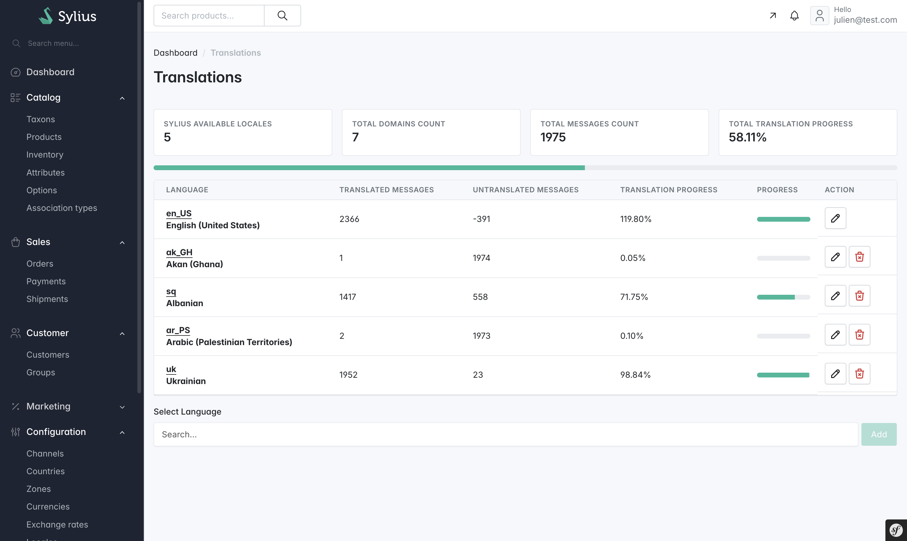

## Sylius Translation plugin

The main goal of this plugin is to enable you to edit translation phrases, without having to manually create or modify translation files on the server. This plugin allows you to change any phrase that is in Silyus in admin panel. All custom translations are saved in the `xliff` format.




In the admin panel view for each locale (enabled in the Sylius) shows how many messages have been translated, how many are left and translation progress.


## Installation

```bash
$ composer require acseo/sylius-translation-plugin
```

Register bundle:
```php
# config/bundles.php

Yaroslavche\SyliusTranslationPlugin\YaroslavcheSyliusTranslationPlugin::class => ['all' => true],
```

Import services:
```yaml
# config/services.yaml

imports:
    # ...
    - { resource: "@YaroslavcheSyliusTranslationPlugin/Resources/config/services.yml" }
```

Import routing
```yaml
# config/routes.yaml

yaroslavche_sylius_translation_plugin:
    resource: "@YaroslavcheSyliusTranslationPlugin/Resources/config/admin_routing.yml"
```

Add twig_hook in v2 :

```yaml
sylius_twig_hooks:
    hooks:
        'sylius_admin.base#stylesheets':
            app_styles:
                template: 'admin/stylesheets.html.twig'
        'sylius_admin.base#javascripts':
            app_javascripts:
                template: 'admin/javascripts.html.twig'

        'sylius_shop.base#stylesheets':
            app_styles:
                template: 'shop/stylesheets.html.twig'
        'sylius_shop.base#javascripts':
            app_javascripts:
                template: 'shop/javascripts.html.twig'

        'sylius_admin.translation.index':
            sidebar:
                template: '@SyliusAdmin/shared/crud/common/sidebar.html.twig'
                priority: 200
            navbar:
                template: '@SyliusAdmin/shared/crud/common/navbar.html.twig'
                priority: 100
            content:
                template: '@YaroslavcheSyliusTranslationPlugin/translation.html.twig'
                priority: 0
```


Install assets and clear cache.
```bash
$ yarn build
$ bin/console assets:install
$ bin/console cache:clear
```

see on `/admin/translation/`
